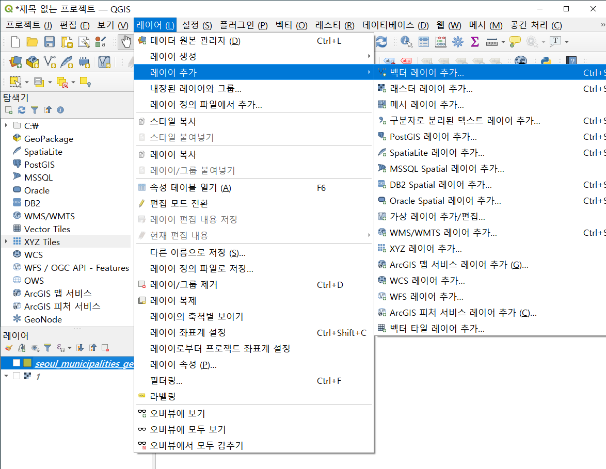
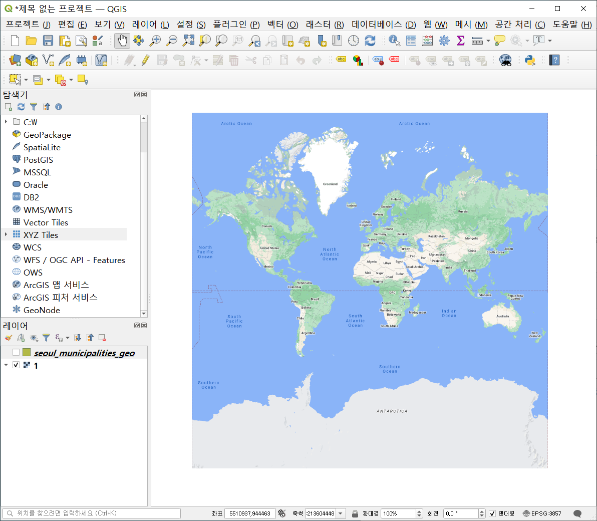
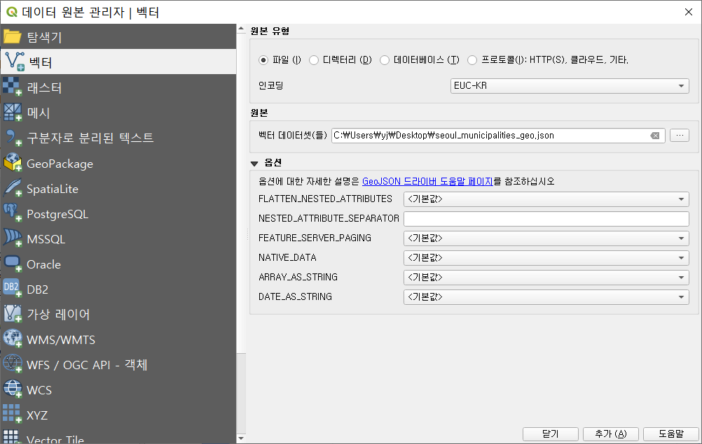
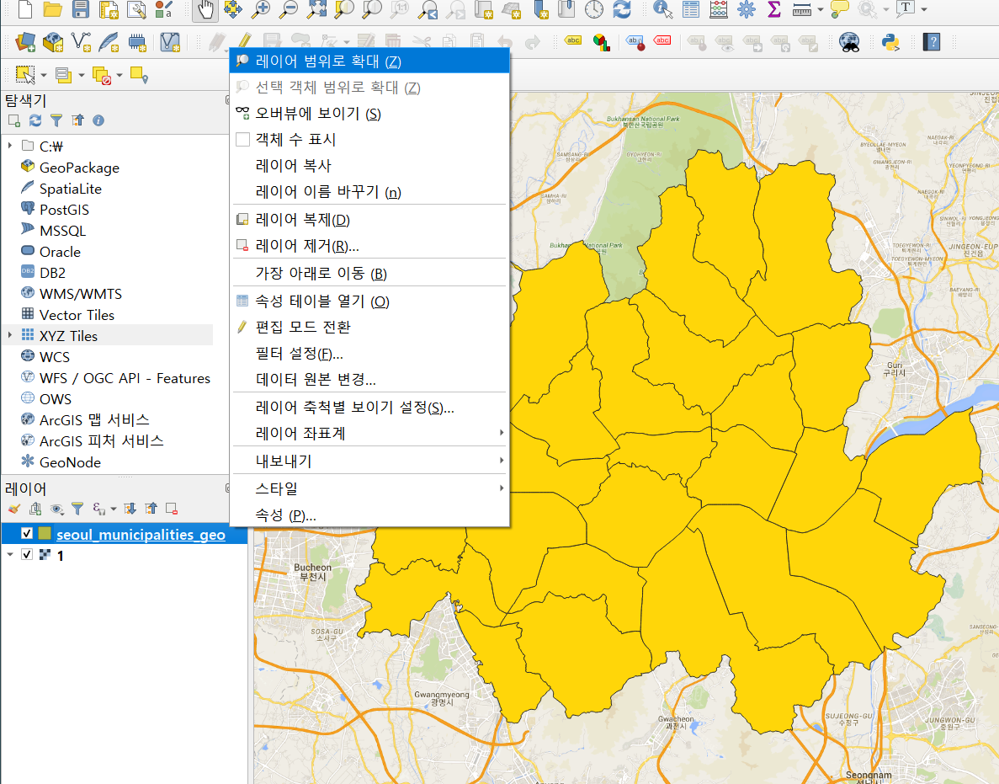

#### QGIS 열어서 <벡터 레이어를 추가>




#### XYZ 연결 - 새로 생성


URL에 [구글맵 URL:  http://mt0.google.com/vt/lyrs=m&hl=kr&x={x}&y={y}&z={z}&s=Ga] 넣고 확인.



구글맵이 뜨는 것을 볼 수 있다.


##### 서울 지도 추가하기

레이어 추가하기.



인코딩은 EUC-KR로, 원본 파일은 json 파일 가져와서 추가.



구글맵 위에 서울 지도가 추가된 것을 볼 수 있다. **레이어 순서 주의해야함.**


#### 내보내기

레이어 결합.

[내보내기]하면 [벡터 레이어를 다른 이름으로 저장] 창이 뜸.

```txt
포맷: CSV

좌표계는 기본 좌표계로, 인코딩은 EUC-KR
```

